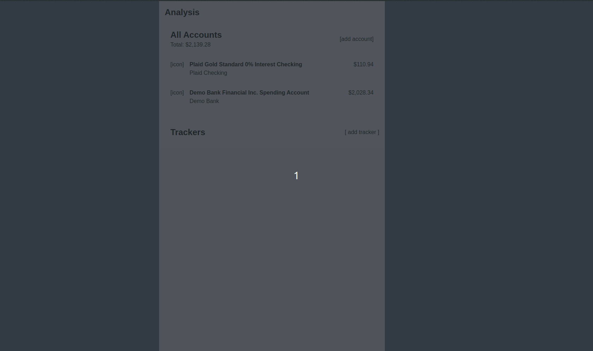
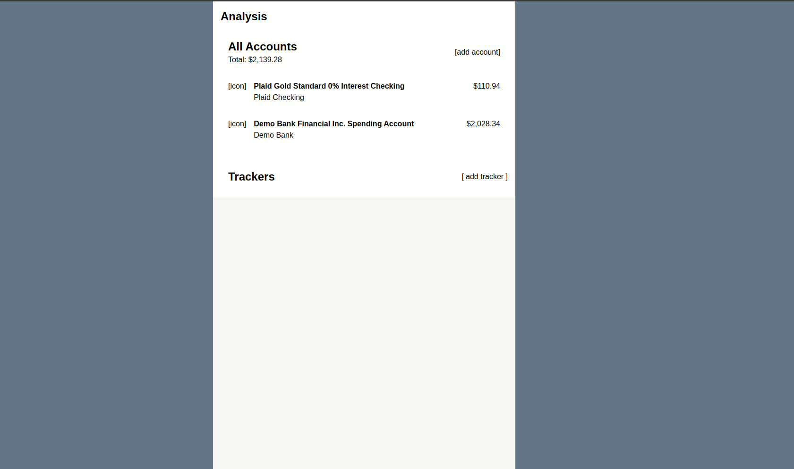
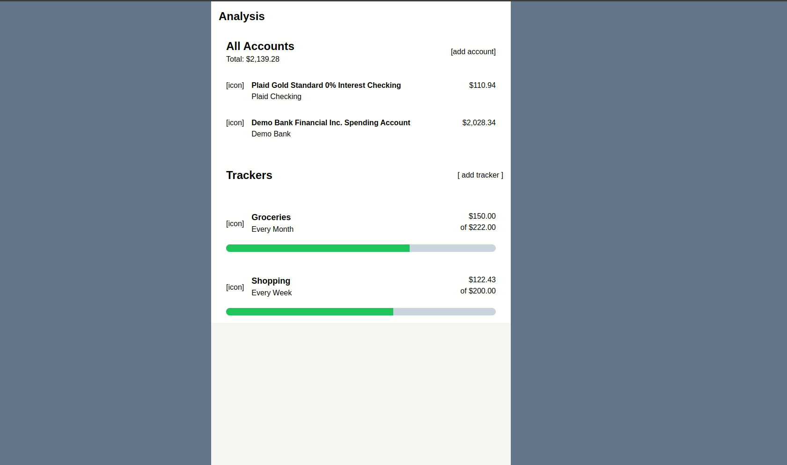

### [Back To README](../README.md)

## User Story Recorings
> The customer must be able to view their accounts connected with the company and the
  balances associated with each account. (You may assume that 1 or more accounts have
  already been created with associated transactions)

Users can view their accounts and balances in the following ways:

- at the home screen there is a summary list of the first _n_ accounts, each showing the account name and balance
- clicking the `all accounts` header navigates to a page listing all accounts and balances (grouped by account type)
- clicking a specific account from either the home page, or accounts list page, takes the user to a view account page where the account information and balances can be viewed

> The customer must be able to view their transaction history for any selected account.

Users can view their transaction history on the "View Account" page, accessible by clicking an account on either the home page or accounts list page.

> The customer should be able to create, view, update, and remove spend trackers.

Users can create new spend trackers using the `[add]` button placed on both the home page and list trackers pages. Trackers can be viewed by clicking the tracker from the homepage, or by clicking the `Trackers` header to navigate to the trackers list page. A user can update a tracker by navigating to the view tracker page and selecting the `[edit]` button. Trackers can be deleted from the view tracker page using the `[delete]` button.

> The customer should be able to visualize their spending over a period of at least 1 week, so
  as to determine if they have exceeded their budgeted spend limit for any pre-determined
  category.

Users can visualize the spending for a given category by viewing the spending tracker progress bar, visible on the home, list, and view tracker pages.